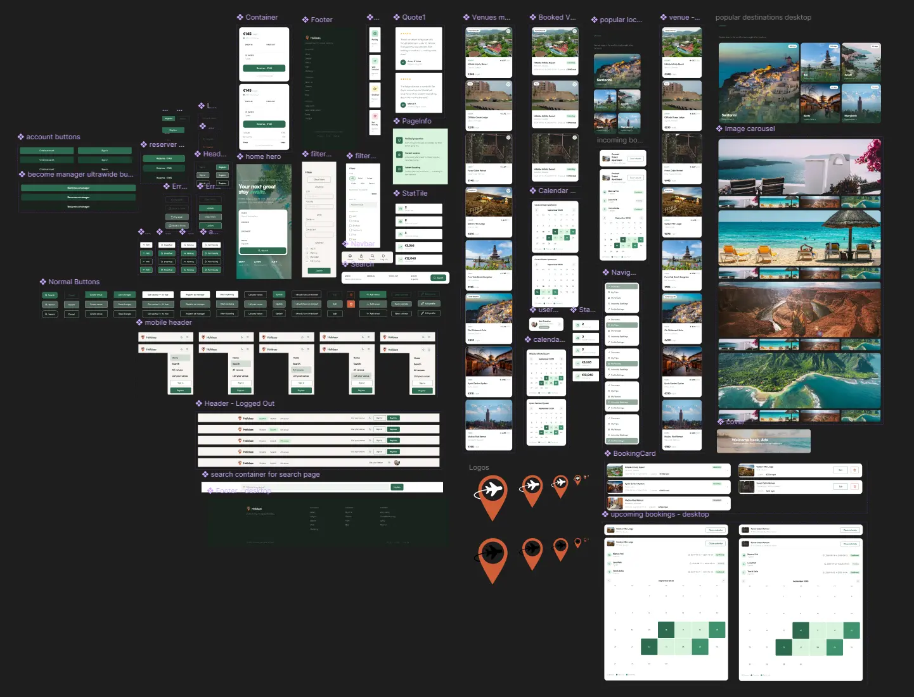
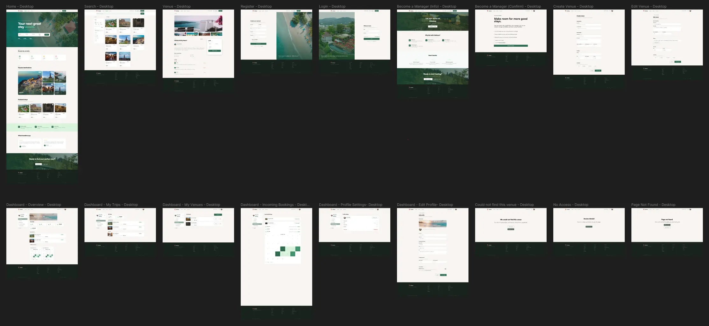
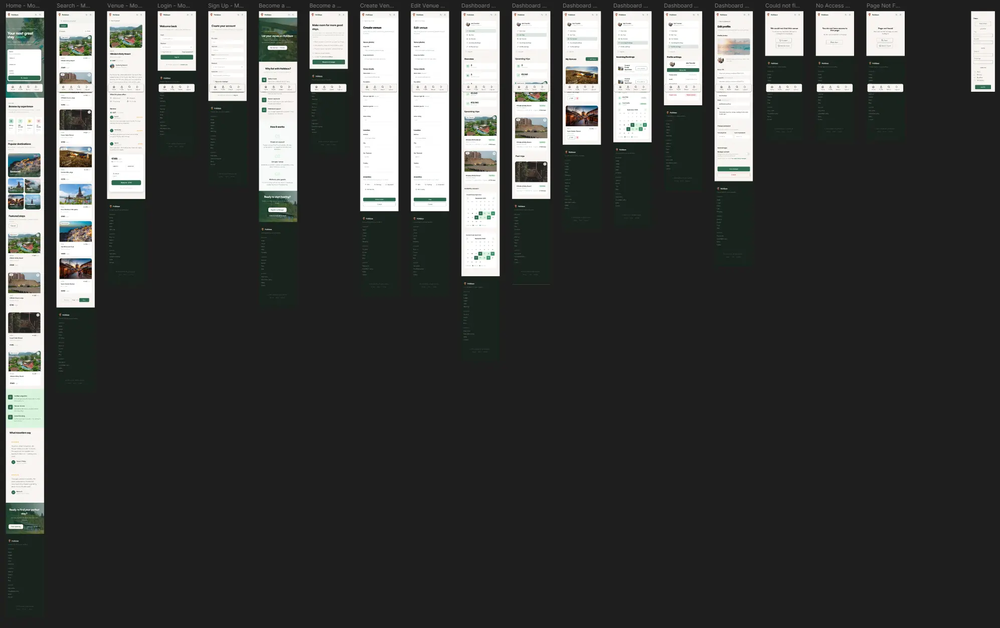
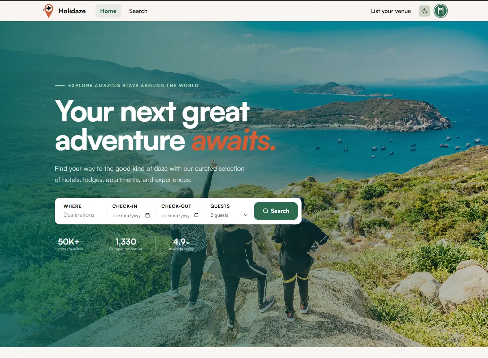
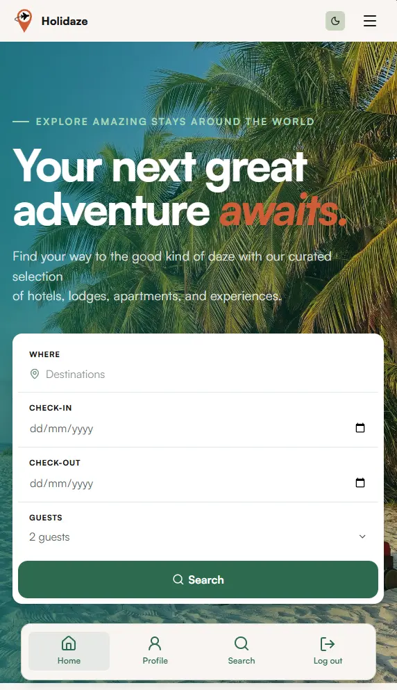

# Holidaze

<p align="center">
  
</p>

<p align="center">The good kind of daze: Find your way to the good kind of daze with our curated selection of hotels, lodges, apartments, and experiences.</p>

## Contents

<details>
  <summary>Table of Contents</summary>

- [1. Project Overview](#1-project-overview)
  - [Project Links](#project-links)
- [2. Setup and Installation](#2-setup-and-installation)
- [3. User Roles and Testing](#3-user-roles-and-testing)
- [4. Technologies Used](#4-technologies-used)
- [5. Features](#5-features)
- [6. Accessibility and Responsive Design](#6-accessibility-and-responsive-design)
- [7. Figma and Screenshots](#7-figma-and-screenshots)
- [8. Testing and Validation](#8-testing-and-validation)
- [9. Known Limitations](#9-known-limitations)
- [10. Credits](#10-credits)
- [11. Contact](#11-contact)

</details>

---

## 1. Project Overview

Holidaze is an accommodation booking platform built for the NOROFF FED2 exam project. Visitors can browse and search venues, customers can make bookings, and venue managers can create and manage their own venues and bookings.

The application uses the official NOROFF Holidaze API and provides separate customer and venue-manager dashboard experiences while keeping one account and one login flow.

### Project Links

- GitHub repository: [https://github.com/larstp/Holidaze](https://github.com/larstp/Holidaze)
- Live site: [holidaze.larstp.com](https://holidaze.larstp.com)
- GitHub project board: [Holidaze](https://github.com/users/larstp/projects/10)
- Figma boards, prototypes, and stylesheet: [View Figma resources](#7-figma-and-screenshots)

---

## 2. Setup and Installation

### Prerequisites

- Node.js and npm installed
- A Noroff API key

### Installation

1. Clone the repository.
2. Install dependencies:

   ```bash
   npm install
   ```

3. Create a local `.env` file based on `.env.example`:

   ```env
   VITE_API_BASE_URL=https://v2.api.noroff.dev
   VITE_NOROFF_API_KEY=your-api-key
   ```

4. Start the development server:

   ```bash
   npm run dev
   ```

5. Create a production build when needed:

   ```bash
   npm run build
   ```

### Available Scripts

```bash
npm run dev          # Start the Vite development server
npm run build        # Typecheck and create a production build
npm run preview      # Preview the production build locally
npm run typecheck    # Run TypeScript checks
npm run lint         # Run ESLint
npm run format:check # Check Prettier formatting
```

Never commit `.env` or expose an API key in documentation. Use `.env.example` for shared configuration instructions.

---

## 3. User Roles and Testing

The application supports three user states:

### Visitor

Visitors can:

- Browse venues
- Search and filter venues
- View venue details and availability
- Register or sign in

### Customer

Customers can:

- View their customer Overview and My Trips pages
- Select dates and guests
- Create bookings
- View ongoing, upcoming, and past trips
- Update their profile, banner, bio, and avatar
- Log out

### Venue Manager

Venue managers can:

- View the manager Overview
- Create, edit, and delete their own venues
- View incoming bookings
- See booking calendars and historical bookings
- Update their profile, banner, bio, and avatar
- Use customer booking and trip features through the same account

### Creating a Test Account

Use the registration form with:

- A `@stud.noroff.no` email address
- A username containing letters (A-Z only), numbers, and underscores
- A password with at least eight characters
- The manager option enabled when a venue-manager account is needed

For clean session testing, use a private/incognito browser window.

---

## 4. Technologies Used

- **React 19** - User interface
- **TypeScript** - Type-safe application code
- **Vite** - Development server and production bundling
- **React Router** - Client-side routing
- **CSS Modules** - Component and page styling
- **Satoshi** - Local variable webfont
- **Lucide React** - Interface icons
- **React DayPicker** - Availability calendars
- **FullCalendar** - Incoming booking calendars
- **Noroff Holidaze API v2** - Authentication, profiles, venues, and bookings
- **Vercel** - Deployment

---

## 5. Features

### Discovery

- Home page with hero carousel, amenities, popular destinations, featured stays, trust content, and traveller reviews
- Venue browsing with alphabetical ordering
- Keyword search using the API search endpoint
- City and country filters
- Multiple amenity filters requiring all selected amenities
- Date availability filtering
- Responsive venue cards with image fallbacks

### Venue Details and Booking

- Venue media gallery with fallback handling
- Venue information, location, amenities, capacity, and rating
- Expandable availability calendar
- Booked, selected, available, and disabled date states
- Booking summary with nights, guests, and total price
- Booking confirmation dialog before the API request
- Clear success and conflict feedback

### Authentication and Profiles

- Customer and venue-manager registration
- Login with requested-destination redirects
- Session restoration after refresh
- Logout
- Profile settings
- Editable avatar, banner, and bio
- Browser-preferred light/dark theme with saved theme choice

### Dashboards

- Customer Overview at `/dashboard/overview`
- Customer My Trips at `/dashboard`
- Manager Overview at `/dashboard/manager/overview`
- Manager My Venues at `/dashboard/manager/venues`
- Incoming Bookings at `/dashboard/manager/bookings`
- Protected customer and manager routes
- Access denied and not-found states
- Loading, empty, error, confirmation, and success states

---

## 6. Accessibility and Responsive Design

The application includes:

- Semantic page landmarks and heading hierarchy
- Labels for form controls
- Keyboard-focusable links, buttons, menus, and calendars
- Visible `:focus-visible` states
- Accessible names for icon-only controls
- `role="alert"` and `role="status"` feedback
- Accessible expandable calendars and dialogs
- Alt text and fallback handling for dynamic images
- Responsive phone, tablet, and desktop layouts
- Reduced-motion support for animations and loaders
- Light/dark theme support

Accessibility is manually checked with keyboard navigation, Lighthouse, and WAVE before submission.

---

## 7. Figma and Screenshots

### Figma

- [Desktop prototype](https://www.figma.com/proto/q6BrHjloIq7GeEVPmDsqpT/Holidaze?node-id=2765-14630&viewport=521%2C662%2C0.06&t=07lJ8MJXFFsgjOo4-1&scaling=scale-down&content-scaling=fixed&page-id=1%3A2)

- [Desktop Board](https://www.figma.com/design/q6BrHjloIq7GeEVPmDsqpT/Holidaze?node-id=1-2&t=FspB3cPysVhVZuUr-1)

- [Mobile prototype](https://www.figma.com/proto/q6BrHjloIq7GeEVPmDsqpT/Holidaze?node-id=2726-535&p=f&viewport=-1813%2C3963%2C0.46&t=BlgZVken5F5vm2K1-1&scaling=scale-down&content-scaling=fixed&starting-point-node-id=2726%3A535&page-id=0%3A1)

- [Mobile Board](https://www.figma.com/design/q6BrHjloIq7GeEVPmDsqpT/Holidaze?node-id=0-1&t=FspB3cPysVhVZuUr-1)

- [Stylesheet](https://www.figma.com/proto/q6BrHjloIq7GeEVPmDsqpT/Holidaze?node-id=2956-27058&p=f&viewport=1304%2C410%2C0.21&t=mcHeYnIugamBHTIf-1&scaling=min-zoom&content-scaling=fixed&page-id=2726%3A606)

<details>
   <summary>View Figma boards</summary>

### Components and style guide



### Desktop board



### Mobile board



</details>

### Screenshots

<details>
   <summary>View webpage screenshots</summary>

### Home desktop



### Home mobile



</details>

### Project Notes

- [Third-party sources and license notes](documentation/Notes.md)

---

## 8. Testing and Validation

### Automated checks

Run these before delivery:

```bash
npm run typecheck
npm run lint
npm run format:check
npm run build
```

### Manual checks

Test visitor, customer, and manager flows in a normal browser and in an incognito window. Important paths include:

- Registration and login
- Session persistence and logout
- Protected route redirects
- Customer and manager Overview pages
- My Trips
- Venue search and filters
- Booking date conflicts and confirmation
- Venue creation, editing, and deletion
- Incoming bookings and past booking styling
- Broken image fallbacks
- Mobile navigation and responsive layouts
- Keyboard navigation and visible focus

### Known build warnings

The production build may report a Vite `__dirname` configuration warning and a large JavaScript chunk warning. These do not prevent the build from completing.

---

## 9. Known Limitations

### Mock and Demonstration Data

Some presentation elements are intentionally mocked to make the application feel like a complete accommodation platform while staying within the official API scope:

- Venue-page reviews and comments use local demonstration data because the API does not provide a review resource.
- The Profile Settings **Delete account** control is displayed as a disabled placeholder because account deletion is not part of the implemented API flow.
- Some trust content, traveller quotes, and homepage review content are local presentation data.
- Footer links such as Privacy, Terms, Cookies, and support links are presentational navigation placeholders.

These elements do not make API requests and do not affect authentication, venue management, bookings, or other live API data.

- The official API does not provide payment or checkout endpoints.
- The official API does not provide guest review creation or rating aggregation.
- Venue ratings are manager-assigned values.
- Venue and profile images use external URLs rather than file uploads.
- The application uses local demonstration reviews where the API has no review resource.
- Automated browser and screen-reader tests are not included in the current project scripts.

---

## 10. Credits

### Icons

- [Lucide React](https://lucide.dev/) - Interface icon library

### Images

- Venue and decorative photography is sourced from [Unsplash](https://unsplash.com/) under the [Unsplash License](https://unsplash.com/license).

### Fonts

- [Satoshi](https://www.fontshare.com/fonts/satoshi) - Local variable webfont

### Tools and Resources

- [Noroff API documentation](https://docs.noroff.dev/)
- [CSS Loaders](https://css-loaders.com/) by [Afif13](https://github.com/Afif13/) - Loader source and inspiration
- [React DayPicker](https://daypicker.dev/) - MIT-licensed availability calendar
- [FullCalendar](https://fullcalendar.io/) - MIT-licensed incoming bookings calendar
- [React](https://react.dev/)
- [Vite](https://vite.dev/)

---

## 11. Contact

- Author: Lars Torp Pettersen
- Course: NOROFF - FED02 OCT24FT - Project Exam 02 (FM2AJP210)
- Year 2: 2025/2026
